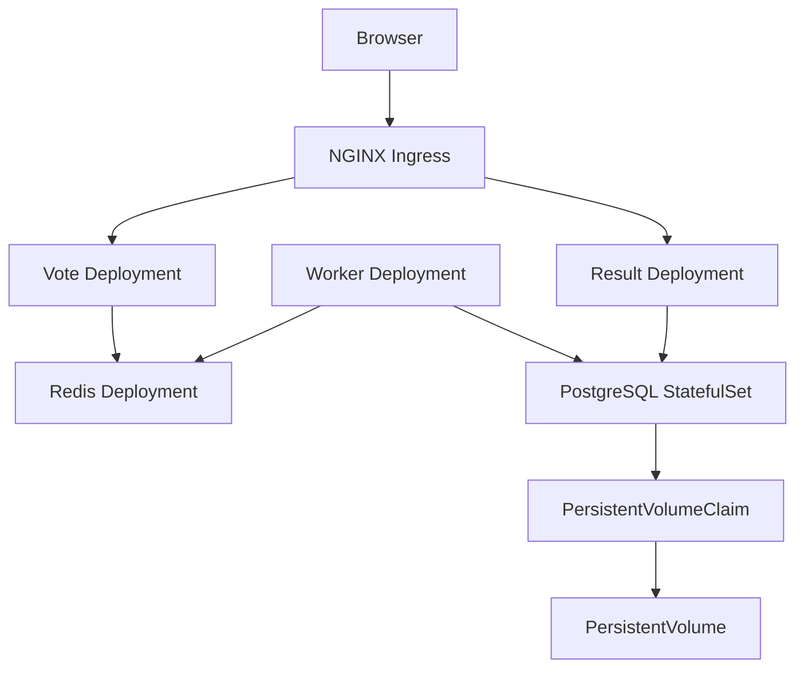

# Example Voting Application on Kubernetes

## Overview

This directory contains an independently designed Kubernetes deployment for the Docker Example Voting Application. It runs on Minikube and includes persistent PostgreSQL storage, Redis queueing, internal services, ingress routing, resource controls, health probes, autoscaling, runtime Secrets, and NetworkPolicies.

## Architecture



## Components

| Component  |      Kubernetes object         |  Replicas |                Purpose                    |
|------------|--------------------------------|----------:|-------------------------------------------|
| Vote       | Deployment, Service, HPA       |    2–5    | Accepts votes and sends them to Redis     |
| Result     | Deployment, Service            |     2     | Displays voting results from PostgreSQL   |
| Worker     | Deployment                     |     1     | Transfers votes from Redis to PostgreSQL  |
| Redis      | Deployment, Service            |     1     | Temporary vote queue                      |
| PostgreSQL | StatefulSet, Services, PVC, PV |     1     | Persistent vote database                  |
| Networking | Ingress, NetworkPolicies       |     —     | External routing and traffic restrictions |

All application Services use `ClusterIP`. The Vote and Result applications are exposed only through one NGINX Ingress.

## Directory Structure

- `common/`: Namespace and non-sensitive ConfigMap.
- `db/`: PostgreSQL StatefulSet, Services, PV, and PVC.
- `redis/`: Redis Deployment and Service.
- `worker/`: Worker Deployment.
- `vote/`: Vote Deployment, Service, and HPA.
- `result/`: Result Deployment and Service.
- `networking/`: Ingress and NetworkPolicies.
- `all.yaml`: Generated root deployment bundle.
- `build-bundle.sh`: Rebuilds `all.yaml` from canonical manifests.
- `create-secrets.sh`: Securely creates runtime Secrets.

The manifests inside the component directories are the source of truth. Do not edit `all.yaml` directly.

## Configuration and Secrets

Non-sensitive configuration is stored in the `voting-app-config` ConfigMap:

- Redis hostname and port
- PostgreSQL hostname, port, and database name
- Vote option labels

Sensitive values are never committed to Git. They are created interactively with:

```bash
./k8s/create-secrets.sh
```

The script creates:

- `postgres-credentials`: PostgreSQL username and password.
- `registry-credentials`: Docker Hub image-pull authentication.

The Docker Hub registry is used as the external container registry equivalent. Custom Vote, Result, and Worker images use the immutable `1.0.0` tag and reference the `registry-credentials` image pull Secret.

## Workload Design

### PostgreSQL

PostgreSQL uses a StatefulSet because it is a stateful workload that benefits from a stable Pod identity and ordered lifecycle.

It uses:

- One headless Service as the StatefulSet governing Service.
- One normal ClusterIP Service for application connections.
- A standalone PVC bound to a Minikube hostPath PV.
- `Retain` as the PV reclaim policy.
- Startup, readiness, and liveness probes using `pg_isready`.
- Resource requests and limits.

The hostPath volume is intended only for this single-node Minikube training environment.

### Redis

Redis uses a Deployment with one replica and an `emptyDir` volume because the vote queue is temporary.

The volume survives a container restart inside the same Pod but is removed when the entire Redis Pod is replaced. This behavior is acceptable because PostgreSQL is the authoritative persistent data store.

Redis includes startup, readiness, and liveness checks using `redis-cli ping`.

### Worker

Worker uses a single-replica Deployment and does not require a Service because it does not accept inbound application traffic.

It reads votes from Redis and writes them to PostgreSQL. Connection information is provided through the ConfigMap and Secret. Its liveness probe verifies that the main Worker process is running.

### Vote

Vote uses a two-replica Deployment and a ClusterIP Service. It communicates only with Redis.

HTTP startup, readiness, and liveness probes use `/` on port 80. A HorizontalPodAutoscaler maintains between two and five replicas and targets 60% average CPU utilization.

Vote is selected for autoscaling because it is a stateless HTTP frontend.

### Result

Result uses a two-replica Deployment and a ClusterIP Service. It reads voting data from PostgreSQL.

HTTP startup, readiness, and liveness probes use `/` on port 80. Two replicas provide availability while ingress cookie affinity keeps long-lived client connections stable.

## Ingress

One Ingress routes two hostnames:

|       Hostname       |   Backend   |
|----------------------|-------------|
| `vote.voting.test`   | `vote:80`   |
| `result.voting.test` | `result:80` |

NGINX cookie affinity uses the `voting-route` cookie. Extended proxy timeouts support the Result application's long-lived Socket.IO connections.

No application NodePort or LoadBalancer Service is used.

## Network Security

The deployment uses a default-deny policy for ingress and egress. Additional policies allow only required communication:

|       Source       |   Destination   |    Port    |
|--------------------|-----------------|-----------:|
| Ingress controller | Vote and Result |     80     |
| Vote               | Redis           |    6379    |
| Worker             | Redis           |    6379    |
| Worker             | PostgreSQL      |    5432    |
| Result             | PostgreSQL      |    5432    |
| Application Pods   | CoreDNS         | 53 TCP/UDP |

NetworkPolicy enforcement requires a compatible CNI. The clean Minikube deployment therefore uses Calico.

## Health and Resources

Every container has resource requests and limits.

Every Service-exposing container has startup, readiness, and liveness probes. The Worker has a process liveness probe because it does not expose a network port.

Readiness probes prevent traffic from reaching unavailable Pods. Startup probes prevent liveness checks from terminating containers during initialization.

## Clean Deployment

> Warning: `minikube delete` removes the existing cluster and its Kubernetes Secrets and data.

Create a clean Calico-enabled cluster:

```bash
minikube delete

minikube start \
  --driver=docker \
  --cpus=4 \
  --memory=6144 \
  --cni=calico

minikube addons enable ingress
minikube addons enable metrics-server
```

Verify the cluster components:

```bash
kubectl get nodes
kubectl rollout status daemonset/calico-node \
  -n kube-system --timeout=300s
kubectl rollout status deployment/calico-kube-controllers \
  -n kube-system --timeout=300s
kubectl rollout status deployment/ingress-nginx-controller \
  -n ingress-nginx --timeout=300s
kubectl rollout status deployment/metrics-server \
  -n kube-system --timeout=300s
```

Rebuild and deploy the complete bundle:

```bash
./k8s/build-bundle.sh
kubectl apply -f k8s/
./k8s/create-secrets.sh
```

Creating the Secrets after applying the bundle is expected. Pods referencing those Secrets recover automatically when the Secrets become available.

Wait for all workloads:

```bash
kubectl rollout status statefulset/db \
  -n voting-app --timeout=300s

kubectl rollout status deployment/redis \
  -n voting-app --timeout=300s

kubectl rollout status deployment/worker \
  -n voting-app --timeout=300s

kubectl rollout status deployment/vote \
  -n voting-app --timeout=300s

kubectl rollout status deployment/result \
  -n voting-app --timeout=300s
```

## Access from Windows and WSL

Add this line to the Windows hosts file:

```text
127.0.0.1 vote.voting.test result.voting.test
```

With the Docker driver in WSL, open a separate terminal and keep this command running:

```bash
minikube service ingress-nginx-controller \
  --namespace ingress-nginx \
  --url
```

Use the HTTP port displayed by the command:

```text
http://vote.voting.test:PORT
http://result.voting.test:PORT
```

The browser may display “Not secure” because the local training deployment uses HTTP without TLS.

## Validation

### Workloads

```bash
kubectl get deployments,statefulsets,replicasets,pods \
  -n voting-app

kubectl get services -n voting-app \
  -o custom-columns='NAME:.metadata.name,TYPE:.spec.type,CLUSTER-IP:.spec.clusterIP'
```

Every application Service should report `ClusterIP`.

### Ingress

```bash
kubectl get ingress voting-app-ingress -n voting-app
kubectl describe ingress voting-app-ingress -n voting-app
```

With the local ingress URL:

```bash
INGRESS_URL='http://127.0.0.1:PORT'

curl --max-time 15 -sS -o /dev/null \
  -w 'Vote HTTP: %{http_code}\n' \
  -H 'Host: vote.voting.test' \
  "$INGRESS_URL/"

curl --max-time 15 -sS -o /dev/null \
  -w 'Result HTTP: %{http_code}\n' \
  -H 'Host: result.voting.test' \
  "$INGRESS_URL/"
```

Both responses should be HTTP `200`.

### Autoscaling and Metrics

```bash
kubectl top pods -n voting-app \
  -l app.kubernetes.io/name=vote

kubectl get hpa vote -n voting-app
```

### End-to-End Vote

1. Open the Vote page.
2. Submit a vote.
3. Open the Result page.
4. Confirm that the result appears within a few seconds.
5. Verify the database:

```bash
kubectl exec -n voting-app db-0 -- \
  psql -U postgres -d postgres \
  -c 'SELECT id, vote FROM votes ORDER BY id;'
```

### PostgreSQL Persistence

Record the database Pod UID:

```bash
kubectl get pod db-0 -n voting-app \
  -o custom-columns='NAME:.metadata.name,UID:.metadata.uid'
```

Delete and recreate only the database Pod:

```bash
kubectl delete pod db-0 -n voting-app

kubectl wait --for=condition=Ready pod/db-0 \
  -n voting-app --timeout=180s
```

Verify that the Pod UID changed and the vote remains:

```bash
kubectl get pod db-0 -n voting-app \
  -o custom-columns='NAME:.metadata.name,UID:.metadata.uid'

kubectl exec -n voting-app db-0 -- \
  psql -U postgres -d postgres \
  -c 'SELECT id, vote FROM votes ORDER BY id;'
```

### Database Backup and Restore

Create a local custom-format backup:

```bash
DB_BACKUP="$(mktemp /tmp/voting-postgres-backup.XXXXXX.dump)"

kubectl exec -n voting-app db-0 -- \
  pg_dump -U postgres -d postgres -Fc > "$DB_BACKUP"

ls -lh "$DB_BACKUP"
```

Restore into an isolated test database:

```bash
kubectl exec -n voting-app db-0 -- \
  dropdb -U postgres --if-exists voting_restore_test

kubectl exec -n voting-app db-0 -- \
  createdb -U postgres voting_restore_test

kubectl exec -i -n voting-app db-0 -- \
  pg_restore --exit-on-error --no-owner \
  -U postgres -d voting_restore_test < "$DB_BACKUP"

kubectl exec -n voting-app db-0 -- \
  psql -U postgres -d voting_restore_test \
  -c 'SELECT id, vote FROM votes ORDER BY id;'
```

Remove only the temporary restored database:

```bash
kubectl exec -n voting-app db-0 -- \
  dropdb -U postgres voting_restore_test
```

### Redis and Worker Recovery

Before replacing Redis, confirm that the real vote queue is empty:

```bash
REDIS_POD="$(kubectl get pod -n voting-app \
  -l app.kubernetes.io/name=redis \
  -o jsonpath='{.items[0].metadata.name}')"

kubectl exec -n voting-app "$REDIS_POD" -- \
  redis-cli LLEN votes
```

After a Redis restart or replacement:

```bash
kubectl rollout status deployment/redis \
  -n voting-app --timeout=180s

kubectl exec -n voting-app deployment/redis -- \
  redis-cli PING

kubectl logs deployment/worker \
  -n voting-app --tail=30
```

The expected Worker behavior is to retry Redis and reconnect automatically.

### NetworkPolicy Enforcement

Confirm Calico is running:

```bash
kubectl get daemonset calico-node -n kube-system
kubectl get networkpolicy -n voting-app
```

Allowed Vote-to-Redis connection:

```bash
kubectl exec -n voting-app deployment/vote -- \
  python -c 'import socket; socket.create_connection(("redis",6379),3).close(); print("ALLOWED: vote to redis")'
```

Denied Vote-to-PostgreSQL connection:

```bash
kubectl exec -n voting-app deployment/vote -- \
  python -c 'import socket,sys
try:
    socket.create_connection(("db",5432),3)
    print("UNEXPECTED: connection allowed")
    sys.exit(1)
except OSError:
    print("DENIED: vote to database")'
```

### Secret Safety

Display only Secret metadata:

```bash
kubectl get secret \
  postgres-credentials \
  registry-credentials \
  -n voting-app \
  --show-labels
```

Secret values, Docker Hub tokens, generated backups, and local credentials must never be committed to Git.
